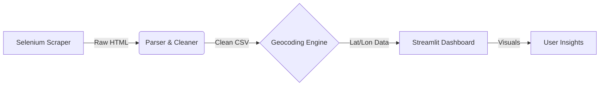

# 🏙️ Chennai Real Estate Insights Engine

### An End-to-End Data Pipeline to Identify Undervalued Property Listings

**Status:** ✅ Completed | **Tech Stack:** Python, Selenium, Streamlit, Plotly, Geopy

---

## 📖 Overview

Moving beyond static "Kaggle datasets," this project builds a live analytics engine from scratch. It scrapes real-time housing data from dynamic web pages, cleans messy real-world inputs (Indian currency formats, unstructured addresses), and visualizes the market using an interactive geospatial dashboard.

The core feature is the **"Deal Rater" Algorithm**, which statistically compares individual listings against the neighborhood median to flag properties priced **10% below market value**.

---

## 🚀 Key Features

* **🕷️ Automated Web Scraper:** Built a **Selenium** bot to handle infinite scrolling, dynamic DOM loading, and pagination to aggregate 200+ listings.
* **🧹 Custom ETL Pipeline:**
* Parses mixed currency formats (e.g., "₹ 1.5 Cr", "₹ 85 Lacs") into standard integers.
* Normalizes inconsistent location strings for accurate mapping.


* **🌍 Geospatial Enrichment:** Integrated **Geopy** & OpenStreetMap API to convert text addresses into Latitude/Longitude coordinates (79% hit rate).
* **📊 Interactive Dashboard:** A **Streamlit** app featuring:
* **Price Heatmap:** Mapbox visualization of expensive vs. affordable zones.
* **Smart Tooltips:** Custom hover data showing prices in "Cr/Lakhs".
* **Arbitrage Finder:** Automatically highlights undervalued deals.


---

## 🛠️ Architecture



## 📸 Screenshots

### 1. The Interactive Dashboard

*(Upload your dashboard screenshot here)*

### 2. The "Deal Rater" in Action

*(Upload your scatter plot screenshot here)*

---

## 💻 Installation & Usage

**1. Clone the repository**

```bash
git clone https://github.com/yourusername/chennai-real-estate-engine.git
cd chennai-real-estate-engine

```

**2. Install Dependencies**

```bash
pip install pandas selenium streamlit plotly geopy webdriver-manager

```

**3. Run the Pipeline**

* **Step 1: Scrape Data** (Opens Chrome to fetch latest listings)
```bash
python scraper.py

```


* **Step 2: Parse & Clean** (Converts HTML to CSV)
```bash
python parser.py

```


* **Step 3: Geocode** (Adds Map Coordinates)
```bash
python geocoder.py

```


**4. Launch Dashboard**

```bash
streamlit run app.py

```

---

## 📂 Project Structure

* `scraper.py`: Selenium logic to handle infinite scroll and save raw HTML.
* `parser.py`: BeautifulSoup logic to extract Price, Title, and Sqft.
* `geocoder.py`: Connects to Nominatim API to fetch Lat/Lon for neighborhoods.
* `app.py`: The frontend application code using Streamlit.
* `data/`: Contains the raw and processed CSV files.

---

## 🧠 Challenges Solved

1. **Infinite Scroll:** The target website loads data dynamically. `BeautifulSoup` alone returned empty results, so I implemented `Selenium` to simulate user scrolling behavior.
2. **Indian Numbering System:** Standard libraries fail on "Lakhs" and "Crores". I wrote a custom parser to normalize these into standard float values for statistical analysis.
3. **API Rate Limiting:** To respect OpenStreetMap's usage policy, I implemented a caching mechanism that only looks up unique locations once, reducing API calls by 90%.

---

## 🔮 Future Improvements

* Add a **Machine Learning** model (Random Forest) to predict property prices based on features.
* Set up a **Cron Job** to run the scraper weekly and track price trends over time.

---

### Author

**Navin Vishwa** 
[LinkedIn Profile](https://www.linkedin.com/in/navinvishwa/)
